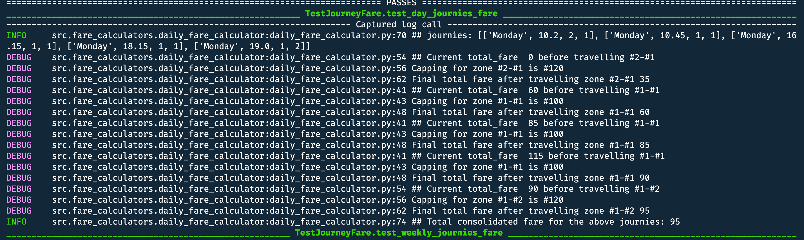
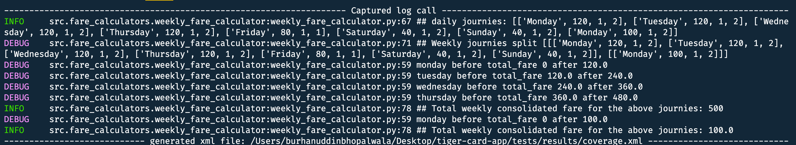
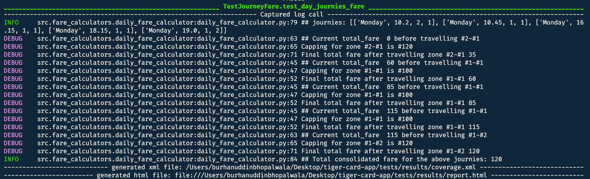
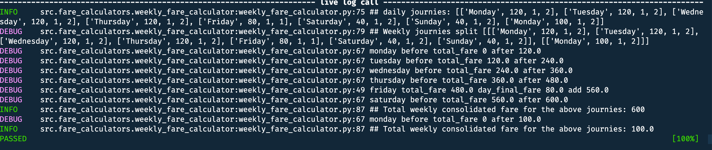

# Tiger Card App

Tiger Card App serves 2 use cases as of now of calculating daily & weekly fares given journies.

> The module has been developed in less than hour and thus mentions TODO, where a best approach has intentionally left. Like

`Zone`: src/zone.py

`DailyJourney`: src/journey.py

`WeeklyJourney`: src/journey.py

`Fare (Parent class)`: src/fare_calculators/fare.py

`DailyFareCalculator (Child class)`: src/fare_calculators/daily_fare_calucator.py

`WeeklyFareCalculator (Child class)`: src/fare_calculators/weekly_fare_calucator.py

## UML Paradigm & Implementation Details


## Evaluation / Testing

The approach is strickly follows TDD approach to strive for maximum code coverage (> 80%).

To test the module, please tick the dependencies:

1: python 3.8.5 + pipenv as dependency manager

2: Checkout to the project root directory:
`cd . && pipenv install`

3: Either to test daily or weekly fare calculators the inputs can be alter here: `tests/test_fare_calcualor.py`

4: Finally to run the module please issue any of the commands.
<br>**integrationtest: is the combine daily + weekly fare calculator**

```bash
pipenv run python -m pytest tests/ -m dailyfaretest
pipenv run python -m pytest tests/ -m weeklyfaretest
pipenv run python -m pytest tests/ -m integrationtest
```

## Outputs

The outputs can be realize as follows:

1: Test Case status & coverage (below is snapshot - 2 test cases status): [here](./tests/results/report.html)


2: Coverage can be analyze as: [here](./tests/results/coverage.xml) -> `/tests/results/coverage.xml`

> TODO: Safety and Dependency checks since pre-commit is not configured.

## Feedback

Thanks for the feedback. Please find the assetion response as follows:

1: _tests assertions are invalid (i.e not passing the sample tests given in the problem statement)_

I concede this statement and has made changes to `src/fare_calculators/fare.py`.
However as per the test case 1 provided in the problem statement (for daily fare) The output realized is _95_. PFA


As mention that daily cap reaches in the second last trip from zone 1 to zone 1, whose daily cap limit is 100. Contrasting to the problem statement doc where the daily limit is reached at the last trip (1-2 with capping 120) - so the output realized is 95 after the corrections. thx

2: _Implementation gap between daily fare and weekly fare._

Yes, I dwell down and find to calculate accorss the weeks. I pushed the changes for the same. On getting more insights i found that the output is coming to 600. PFA


As shows the above pic, the weekly cap reached during second last trip (1-1, with weekly capping of 500) thus first week capping comes out be 500 instead of 600. On adding the next week fare [100] it comes out to be 600 not 700 as the final output. thx

## Fix after Feedback

Fix is to missing a constraints as per the problem statment stat as:
<p></p>The cap that is applicable for a day is based on the farthest journey in a day. For example, if a
few journeys are within zone 1 and a single journey is between zone 1 & 2, then the daily cap
applicable will be the one for zone 1 - 2. The first example later in the document illustrates the
same. The weekly cap uses the same logic as the daily cap when determining the zones
applicable for the week.</p>

**Post fix, both the test cases has been passed as expected.**

Test case 1 daily output after revision realized to be 120.


Test case 2 weekly output after fix realized to be 700.


> To generate the above DEBUG logs please change `pytest.ini` log_levels to **DEBUG** from **INFO** with markers as mention above
