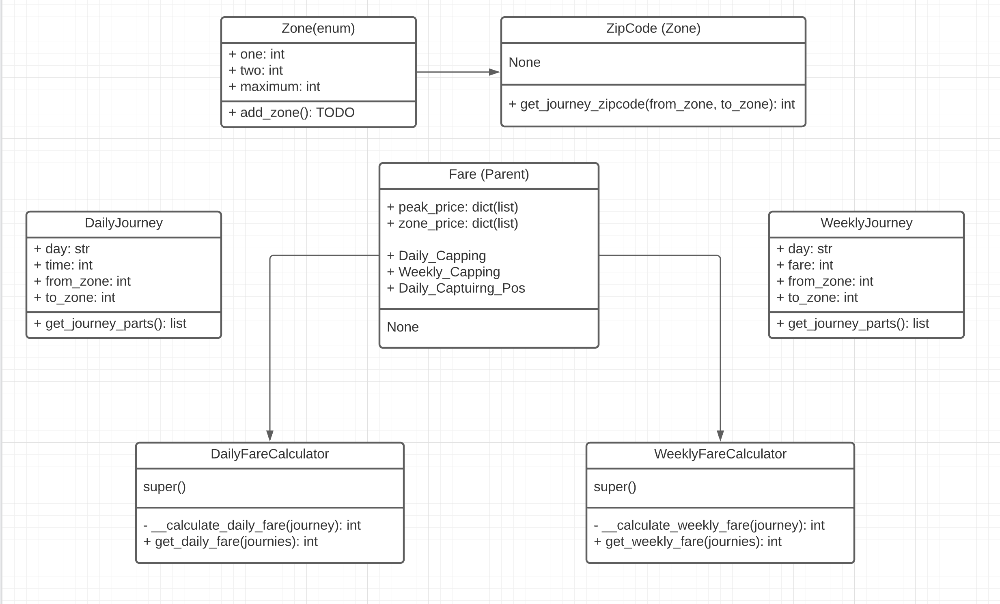

# Tiger Card App

Tiger Card App serves 2 use cases as of now of calculating daily & weekly fares given journies.

> The module has been developed in less than hour and thus mentions TODO, where a best approach has intentionally left. Like

`Zone`: src/zone.py

`DailyJourney`: src/journey.py

`WeeklyJourney`: src/journey.py

`Fare (Parent class)`: src/fare_calculators/fare.py

`DailyFareCalculator (Child class)`: src/fare_calculators/daily_fare_calucator.py

`WeeklyFareCalculator (Child class)`: src/fare_calculators/weekly_fare_calucator.py

## Paradigm & Implementation Details



## Evaluation / Testing

The approach is strickly follows TDD approach to strive for maximum code coverage (> 80%).

To test the module, please tick the dependencies:

1: python 3.8.5 + pipenv as dependency manager

2: Checkout to the project root directory:
```cd . && pipenv install```

3: Either to test daily or weekly fare calculators the inputs can be alter here: `tests/test_fare_calcualor.py`

4: Finally to run the module please issue any of the commands.
<br>**integrationtest: is the combine daily + weekly fare calculator**

```bash
pipenv run python -m pytest tests/ -m dailyfaretest
pipenv run python -m pytest tests/ -m weeklyfaretest
pipenv run python -m pytest tests/ -m integrationtest
```

## Outputs

The outputs can be realize as follows:

1: Test Case status & coverage (below is snapshot - 2 test cases status): [here](./tests/results/report.html)


2: Coverage can be analyze as: [here](./tests/results/coverage.xml) -> `/tests/results/coverage.xml`

> TODO: Safety and Dependency checks since pre-commit is not configured.

## Feedback
